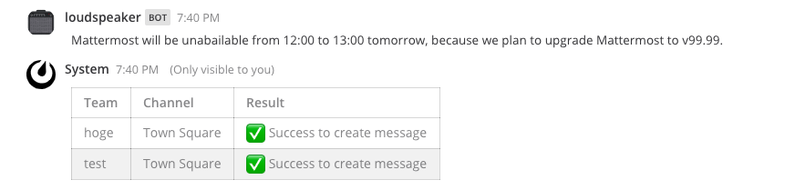

# Mattemrost Plugin **LoudSpeaker** 

Mattermost plugin for announcing something to all teams.

## Usage

If you execute the command like the following, Mattermost create posts on the default channel in all teams.

```
/loudspeaker [message]
```



## To do...

* Restrict usage to system_admin
* Enable to specify a team to exclude (in admin console?)
